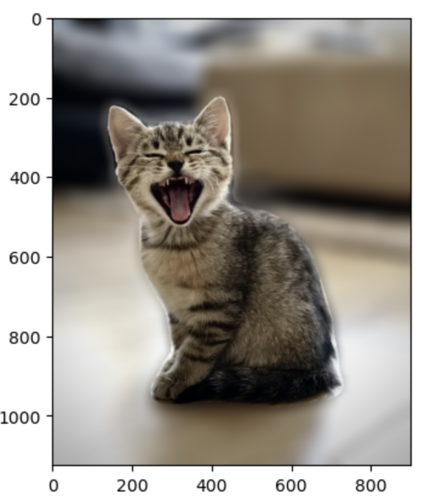
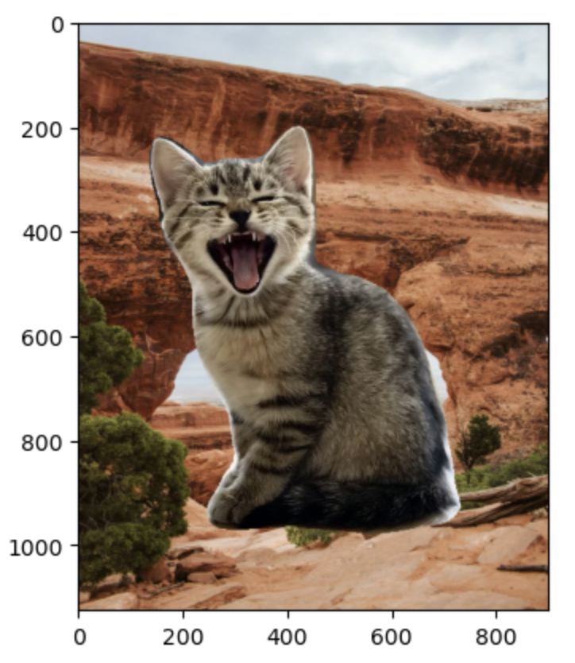
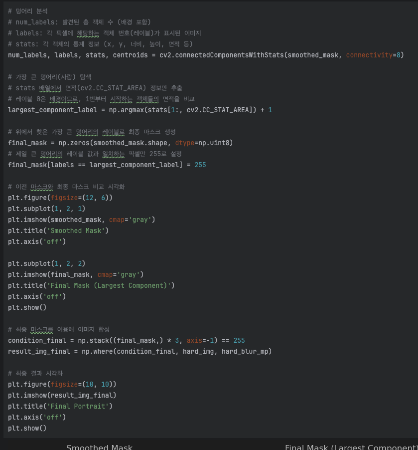
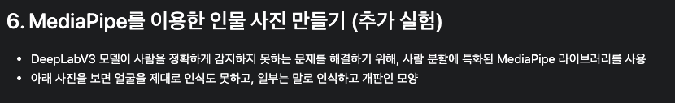
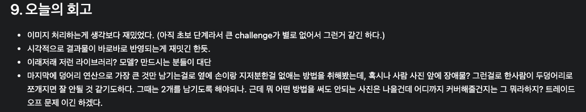

# AIFFEL Campus Online Code Peer Review Templete
- 코더 : 최범용
- 리뷰어 : 


# PRT(Peer Review Template)
- [X]  **1. 주어진 문제를 해결하는 완성된 코드가 제출되었나요?**
    - 
    - 
    - 
    요구조건 3가지를 모두 만족하여 잘 출력하였다.  
      - 문제에서 요구하는 최종 결과물이 첨부되었는지 확인
       - 중요! 해당 조건을 만족하는 부분을 캡쳐해 근거로 첨부
    
- [X]  **2. 전체 코드에서 가장 핵심적이거나 가장 복잡하고 이해하기 어려운 부분에 작성된 
주석 또는 doc string을 보고 해당 코드가 잘 이해되었나요?**
  - 
  - 코드가 전반적으로 깔끔하게 구분되고 정리되어있어 보기편하고 
  - 구간별로 잘 나누어져 좋았다.
        - 해당 코드 블럭을 왜 핵심적이라고 생각하는지 확인
        - 해당 코드 블럭에 doc string/annotation이 달려 있는지 확인
        - 해당 코드의 기능, 존재 이유, 작동 원리 등을 기술했는지 확인
        - 주석을 보고 코드 이해가 잘 되었는지 확인
            - 중요! 잘 작성되었다고 생각되는 부분을 캡쳐해 근거로 첨부
        
- [X]  **3. 에러가 난 부분을 디버깅하여 문제를 해결한 기록을 남겼거나
새로운 시도 또는 추가 실험을 수행해봤나요?**
  - 
  -  감지에 약한 문제를 인식하고 이를 해결하기 위해 추가적인 파이프라인을 도입 및 실험함
  - 시도를 통해 큰 성과를 보진 못했지만 이를 보완할 추가 계획을 세운게 인상적임
  - 
      - 문제 원인 및 해결 과정을 잘 기록하였는지 확인
      - 프로젝트 평가 기준에 더해 추가적으로 수행한 나만의 시도, 
      실험이 기록되어 있는지 확인
      - 중요! 잘 작성되었다고 생각되는 부분을 캡쳐해 근거로 첨부

        
- [X]  **4. 회고를 잘 작성했나요?**
    - - 
    - 흥미 위주로 적혀있고 시도한 실험에 대한 간략한 요약이 적혀있다.
    - 나도 다음엔 저렇게 적어봐야겠다.
      - 주어진 문제를 해결하는 완성된 코드 내지 프로젝트 결과물에 대해
      배운점과 아쉬운점, 느낀점 등이 기록되어 있는지 확인
      - 전체 코드 실행 플로우를 그래프로 그려서 이해를 돕고 있는지 확인
          - 중요! 잘 작성되었다고 생각되는 부분을 캡쳐해 근거로 첨부
        
- [X]  **5. 코드가 간결하고 효율적인가요?**
    - 지금까지 리서치 약 4번의 리뷰중 가장 깔끔한 코드다
    - 배우고싶다... 이게 노련미..?
      - 파이썬 스타일 가이드 (PEP8) 를 준수하였는지 확인
      - 코드 중복을 최소화하고 범용적으로 사용할 수 있도록 함수화/모듈화했는지 확인
          - 중요! 잘 작성되었다고 생각되는 부분을 캡쳐해 근거로 첨부


# 회고(참고 링크 및 코드 개선)
코드는 물론이고 전반적인 설계또한 깔끔하다
아마 큰 플로우가 머리에 잡혀있어서 좀 더 깔끔한 흐름이 나오는듯 하다
리뷰어도 그렇게 되도록 열심히 해보겠다..
이제 ecplorer는 3번남았지만 뭐 그 이후로도 이것저것 하다보면 좋아지지 않을까
뭔가 코드리뷰보다는 일기장 같긴한데
네 뭐.. 좋은 영향받고갑니다.

```
# 리뷰어의 회고를 작성합니다.
# 코드 리뷰 시 참고한 링크가 있다면 링크와 간략한 설명을 첨부합니다.
# 코드 리뷰를 통해 개선한 코드가 있다면 코드와 간략한 설명을 첨부합니다.
```
