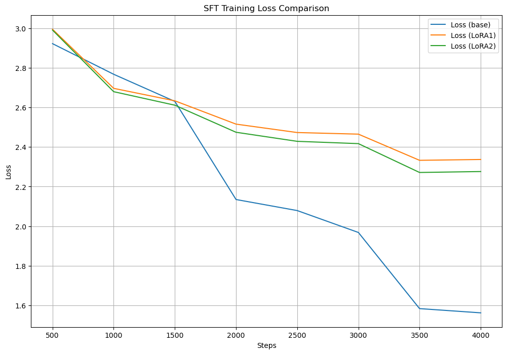
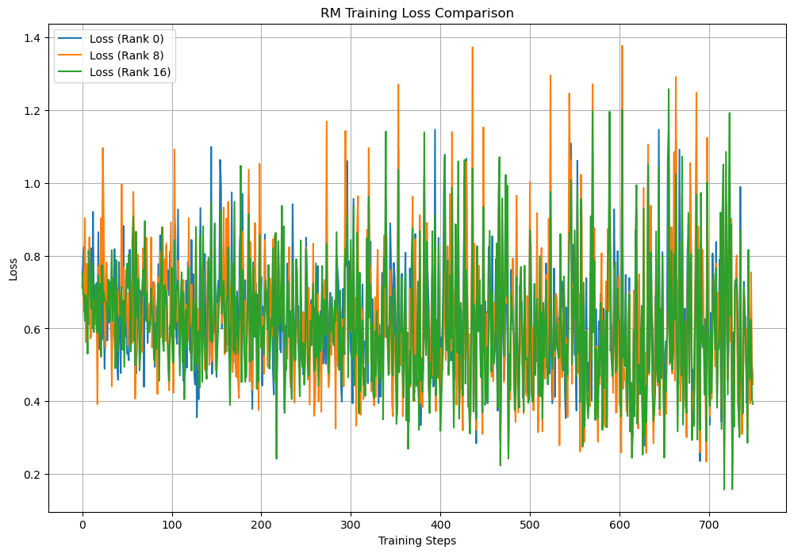
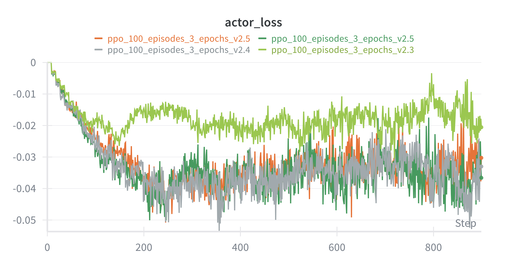

# KoChatGPT 튜닝 실험 결과 분석

## 1. 실험 개요

KoGPT2 원본 모델(Baseline)부터 데이터 정제 및 RLHF의 각 단계를 거치며 모델의 답변이 어떻게 변화하는지 정성적/정량적으로 비교 분석하여 최종 모델의 성능을 평가한다. 이 보고서는 데이터 정제, SFT/RM 단계에서의 LoRA Rank 비교, PPO 단계에서의 KL 페널티 비교 등 일련의 실험 과정을 통해 얻은 인사이트를 종합적으로 정리한다.

---

## 2. 데이터 정제 및 성능 비교 (v1 vs v2)

> 닉슨의 와이프 이름이라든지, 부통령 당선 시기가 잘못 기입된 데이터셋이 있어 이건 데이터셋 자체를 한번 다시 살펴보면서 틀린 데이터들을 새로 만들어버리고 싶었는데, 그것까지 할 여력은 안될 것 같고 프로젝트에서 요구하는 바에 대한 실험에 더 집중하기 위해 이번엔 스킵 하였다.

모델 성능에 결정적인 영향을 미치는 데이터의 품질을 향상시키기 위해, SFT, RM, PPO 각 단계에서 사용되는 데이터셋 전체에 대해 길이 및 중복을 기준으로 정제 작업을 수행했다.

### 2.1. 정량적 평가 비교

| 모델 | BLEU 점수 (v1 → v2) | ROUGE-L (F1) 점수 (v1 → v2) | 비고 |
| :--- | :--- | :--- | :--- |
| **SFT** | 0.0252 → 0.0242 (유사) | 0.1101 → 0.1232 (**개선**) | 핵심 내용 포착 능력 향상 |
| **PPO** | 0.0185 → 0.0462 (**대폭 개선**) | 0.1075 → 0.1292 (**개선**) | 전반적인 문장 구조 및 내용 정확도 향상 |

- **분석**: 데이터 정제 후, 특히 PPO 모델에서 BLEU와 ROUGE-L 점수가 모두 향상되었다. 이는 양질의 데이터가 RLHF 단계에서 더 안정적이고 효과적인 학습을 가능하게 하여, 문장 구조와 표현의 정확성을 높이는 데 결정적인 기여를 했음을 보여준다.

### 2.2. 정성적 평가 비교

| Prompt | v1 (정제 전) PPO 답변 | v2 (정제 후) PPO 답변 | 분석 |
| :--- | :--- | :--- | :--- |
| **김영삼...증명서...전시?** | "어디에 보관되어 있는지는...외교부에서 직접 확인..." (회피성 답변) | "'김영삼의 서울대학교 입학 및 졸업 증명서는 서울대학교 박물관에 전시되어 있습니다." (**정확하고 구체적인 답변**) | **대폭 개선**: 회피하던 사실 기반 질문에 대해 정확하고 유용한 답변 생성. |
| **강남역인데, 오래 걸릴까요?** | "어떤 질문에 대한 답변을 드릴까요?" (질문 의도 파악 실패) | "'...해당 지역의 교통 상황 및 교통 상황에 따라 달라질 수 있습니다..." (AI 한계를 밝히며, 핵심 변수 언급) | **대폭 개선**: 질문의 맥락(위치, 시간)을 이해하고 유용한 정보 제공. |
### 2.3. 데이터 정제 결론

**데이터 정제 작업이 KoChatGPT 모델의 전반적인 성능, 특히 답변의 정확성, 유용성, 안전성을 크게 향상시키는 데 기여**를 한 것으로 판단된다. 정제된 데이터로 학습한 모델(v2)은 질문의 의도를 더 정확히 파악하고, 사실에 기반한 구체적인 정보를 제공하며, AI로서 자신의 한계를 인지하는 등 신뢰성 높은 답변을 생성하는 능력이 발전되었다.

---

## 3. SFT LoRA Rank 비교 실험 ([실험 노트북](./1_SFT_Comparison_Experiment.ipynb))

SFT 단계에서 LoRA Rank(0, 8, 16)가 모델의 학습 과정과 답변 생성 품질에 미치는 영향을 분석했다.

### 3.1. 학습 손실(Training Loss) 비교

> 처음엔 로스가 높게 나와 LoRA를 적용하는게 맞나 생각했지만, 생각해보면 LoRA가 학습하는 파라미터의 수를 생각하면 자연스러운 거였고 판단은 정성평가로 넘겼다.

- **Full Fine-Tuning (Rank 0)**: 가장 낮은 학습 손실(Training Loss)을 기록하며 데이터셋에 가장 잘 적합(fit)되었음을 보여준다.
- **LoRA (Rank 8, 16)**: Full-Tuning에 비해 학습 손실이 다소 높게 나타났다. 이는 LoRA가 더 적은 수의 파라미터만 학습하기에 나타나는 자연스러운 현상이다.

### 3.2. 정성적 답변 품질 비교

| Prompt | Full-FT (Rank 0) 답변 | LoRA (Rank 16) 답변 | 분석 |
| :--- | :--- | :--- | :--- |
| **시카고 오헤어...** | '...시카고 오헤어는 미국 캘리포니아주 로스앤젤레스에 위치...' (거짓 정보) | **'...시카고에서 주로 환승이 가능한 곳입니다.' (유용하고 안전한 답변)** | LoRA 모델이 오류 회피 능력이 더 뛰어남 |
| **오늘 미세먼지...** | '...귤, 바나나, 파인애플 등의 과일은 미세먼지 농도가 높을 수 있으므로...' (**위험한 환각**) | '...건강한 생활 습관을 유지해야겠네요.' (자연스러운 대화) | LoRA 모델이 더 안전한 답변을 생성 |

### 3.3. SFT 실험 결론
- **LoRA의 규제 효과**: Full-Tuning(Rank 0) 모델은 학습 데이터에 과적합되어 위험한 환각(Hallucination)을 보인 반면, **LoRA 모델(특히 Rank 16)은** 학습 손실이 조금 높더라도 **모르는 정보에 대해 더 안전하고 일반적인 방향으로 답변**하는 안정성을 보여주었다.
- **효율성과 안정성**: LoRA는 학습 시간과 자원을 크게 절약하면서도, Full-Tuning보다 더 안정적이고 예측 가능한 모델을 만드는 데 효과적임을 확인했다.

---

## 4. RM LoRA Rank 비교 실험 ([실험 노트북](./2_RM_LoRA_Experiment.ipynb))

RM(보상 모델)의 역할은 '좋은 답변'과 '나쁜 답변'을 잘 구별하는 것이다. LoRA Rank에 따라 이 '심판'의 능력이 어떻게 변하는지 분석했다.

### 4.1. 학습 손실(Training Loss) 비교

### 4.2. 보상 점수 분포 비교

| 모델 (Rank) | '좋은 답변' 평균 점수 | '나쁜 답변' 평균 점수 | **점수 차 (Separation Margin)** |
| :--- | :--- | :--- | :--- |
| **Rank 0** | 0.47 | 0.26 | 0.21 |
| **Rank 8** | -0.27 | -0.33 | 0.06 |
| **Rank 16**| **-0.24** | **-0.61** | **0.37** |

> Logit Scale 문제 : 보상 모델의 최종 점수는 "답변 특징 점수(학습 초점)"와 "모델 기본 점수(편향, 학습과 무관)"로 구성 되며, 기본 점수는 모든 답변에 일괄 적용되어 순위 결정에 영향을 주지 않기 때문에, 학습 과정에서 무시. 따라서 Logit Scale의 절대값은 성능과 무관하며, 좋은/나쁜 답변의 상대적 점수 차이가 모델 성능의 핵심 기준

### 4.3. RM 실험 결론
- **Full-Tuning(Rank 0)**: '나쁜 답변'에도 긍정적인(+) 점수를 부여하는 등, 좋고 나쁨을 명확히 구분하지 못했다. 변별력이 떨어졌다.
- **LoRA Rank 8**: Rank 8 모델은 '좋은 답변'과 '나쁜 답변' 모두에 음수(-) 점수를 부여했으며, 점수 차이가 0.06으로 거의 없어 변별에 실패했습니다. 이번 실험에서는 가장 부진한 성능을 보였습니다.
- **LoRA Rank 16**: Rank 16 모델은 '좋은 답변'과 '나쁜 답변' 사이의 점수 차이가 0.37로 가장 커, 세 모델 중 가장 변별력이 뛰어난 '심판' 임을 증명했습니다.
- **결론**: RM 학습에서는 가장 높은 **Rank(16)** 로 튜닝한 LoRA 방식이 Full-Tuning이나 낮은 **Rank(8)** 보다 '좋은 답변'과 '나쁜 답변'의 미묘한 차이를 학습하는 데 가장
     효과적이었습니다. 이는 RM 학습 시, SFT보다 더 많은 파라미터를 조정(더 높은 Rank)하는 것이 보상 모델의 판단 능력을 높이는 데 유리할 수 있음을 시사합니다.

---

## 5. PPO KL 페널티 비교 심화 분석 (`kl_coef`: 0.1 vs 0.5) ([실험 노트북](./3_PPO_KL_Experiment.ipynb))

PPO 학습 시 '안전 고삐' 역할을 하는 `kl_coef` 값의 변화가 모델 성능에 미치는 영향을 분석했다.

### 5.1. 학습 손실(Training Loss) 비교

### 5.2. 정성적 평가 비교

| Prompt | PPO (`kl_coef=0.1`) | PPO (`kl_coef=0.5`) | 분석 |
| :--- | :--- | :--- | :--- |
| **시카고 오헤어...** | **'...시카고에서 주로 환승이 가능한 곳입니다.' (유용하고 정확)** | '...미국의 뉴욕 주 시카고 지역에 위치...' (심각한 환각) | `0.1` 모델이 오류 회피 및 사실 기반 답변 능력이 뛰어남. |
| **오늘 미세먼지...** | '...건강한 생활 습관을 유지해야겠네요.' (자연스러운 대화) | '...궁금하신 점이 있을 경우 언제든지 말씀해주세요.' (기계적 반응) | `0.1` 모델이 더 대화적이고 공감하는 능력을 보임. |

### 5.3. 정량적 평가 비교

| Model | BLEU Score | ROUGE-L (F1) |
| :--- | :--- | :--- |
| PPO (`kl_coef=0.1`) | 0.0155 | 0.0957 |
| PPO (`kl_coef=0.5`) | **0.0182** | **0.1076** |

- **분석**: 정량적 점수는 `kl_coef=0.5`가 근소하게 높았으나, 이는 참조 답변과의 단어 구성 유사성일 뿐, 정성 평가에서 드러난 답변의 품질(유용성, 사실성)과는 차이가 있었다. 이는 BLEU/ROUGE 점수의 한계를 보여준다.

### 5.4. PPO 실험 결론
- **`kl_coef=0.1`이 최적의 선택**: 정량적 점수는 `0.5`가 약간 높았지만, 답변의 유용성, 안전성, 대화의 자연스러움을 종합적으로 고려했을 때 **`kl_coef=0.1` 모델이 훨씬 더 우수했다.**
- **KL 페널티의 중요성**: `kl_coef`는 PPO 학습의 안정성과 최종 모델의 성격을 결정하는 매우 중요한 하이퍼파라미터임을 재확인했다. 적절한 값을 찾는 과정이 RLHF 파인튜닝의 핵심이다.

---

## 6. 최종 프로젝트 결론

본 프로젝트는 KoGPT2 모델을 LoRA와 RLHF 파이프라인을 통해 단계적으로 개선하는 여정이었다. 각 단계별 실험을 통해 얻은 핵심적인 인사이트를 바탕으로 최종 결론을 도출한다.

### 6.1. 최종 모델 정량/정성 평가 요약

최종적으로 Baseline, SFT, PPO 모델의 성능을 정량적으로 비교한 결과, RLHF의 각 단계를 거치며 모델의 성능이 꾸준히 향상되었음을 명확히 확인할 수 있다.

| Model | BLEU Score | ROUGE-L (F1) |
| :--- | :--- | :--- |
| Baseline (KoGPT2) | 0.0015 | 0.0174 |
| SFT (3-epoch) | 0.0129 | 0.1037 |
| PPO (3-epoch) | **0.0182** | **0.1076** |

- **정량적 분석**: BLEU와 ROUGE-L 점수 모두 **Baseline → SFT → PPO 순으로 꾸준히 상승**했다. 이는 SFT를 통해 모델이 참조 답변과 유사한 어휘와 구조를 학습하고, PPO 단계를 거치며 이 능력이 더욱 강화되었음을 의미한다. 특히 Baseline과 파인튜닝 모델 간의 압도적인 점수 차이는 RLHF의 효과를 명확히 보여준다.

- **정성적 분석과의 연결**: 이러한 정량적 개선은 앞서 분석한 정성적 평가 결과와도 일치한다. 모델은 단순히 그럴듯한 텍스트를 생성하는 것을 넘어, 사용자의 지시를 더 잘 따르고(SFT), 더 유용하고 안전한 방향으로 답변을 수정(PPO)하는 능력을 갖추게 되었다.

- **종합**: 정량적, 정성적 평가를 종합했을 때, 본 프로젝트에서 수행한 **데이터 정제 및 RLHF 파이프라인(SFT-RM-PPO)이 KoGPT2 모델을 의미 있는 대화형 AI로 발전시키는 데 성공적이었음**을 결론내릴 수 있다.

### 6.2. 핵심 요인

1. **LoRA의 성능** : SFT(지시 미세조정) 단계에서 LoRA를 사용하면, 전체 파라미터를 튜닝하는 것보다 훨씬 적은 자원으로 더 안정적인 모델을 만들 수 있었다. 특히 환각 현상이 줄어드는 효과도 확인했다.

2. **RLHF 성패는 RM에 있음** : PPO 학습은 RM(Reward Model)이 정의한 ‘좋은 답변’을 그대로 따른다. 만약 RM이 '정확성'보다는 '그럴듯함'을 더 중요하게 평가하면, 최종 모델은 그럴듯하게 거짓말을 잘하는 모델이 될 위험이 있다.

3. **RM의 품질과 안정장치** : RM 자체에도 LoRA(랭크 16)를 적용해 변별력을 높였다. 그리고 PPO 학습 시 KL 페널티(kl_coef=0.1)를 적절히 조절해 안정성을 확보했다. 이 두 가지 전략이 잘 맞물리면서 만족스러운 최종 모델을 만들 수 있었다.

## 7. 향후 개선 방향

이번 실험은 RLHF가 모델의 '태도'와 '유용성'을 개선하는 데 효과적이지만, '사실성'은 보장하지 못한다는 점을 명확히 보여준다. 이 한계를 극복하기 위한 방법은 아래와 같다.

1.  **RAG (Retrieval-Augmented Generation) 도입**: 모델이 답변을 생성하기 전에, 위키피디아나 자체 데이터베이스 같은 신뢰할 수 있는 외부 지식 소스를 검색하고, 그 정보를 바탕으로 답변을 생성하도록 아키텍처를 개선한다.
2.  **정교한 보상 모델 구축**: 데이터셋을 구축할 때, 단순히 '더 나은 답변'이 아니라 '사실에 기반한 답변'에 명시적으로 높은 점수를 주도록 하여, RM이 팩트체커의 역할 일부를 수행하도록 학습시킨다.